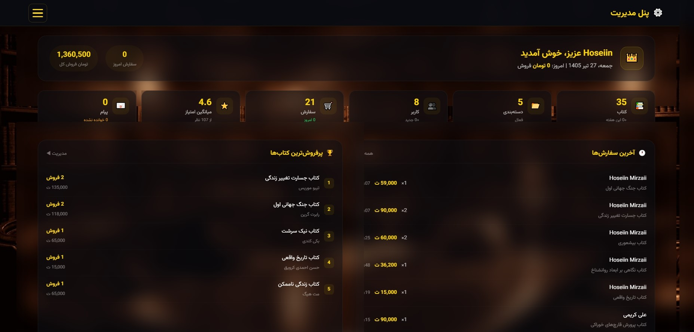
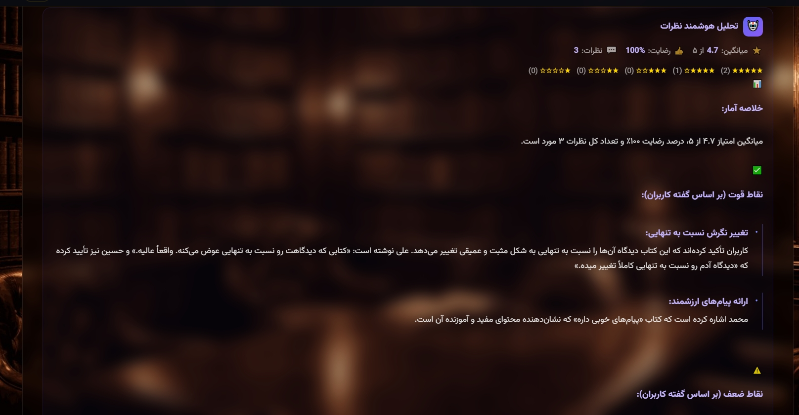

# 📚 پروژه کتابخانه آنلاین با هوش مصنوعی

یه پروژه کامل و هوشمند کتابخانه آنلاین با PHP خام و MySQL. دارای سیستم مشاوره هوشمند کتاب و تحلیل نظرات کاربران.

---

## 🖼️ پیش‌نمایش پروژه

---

## ✨ امکانات پروژه

### 📖 بخش کاربر
- ثبت‌نام و ورود کاربر
- مشاهده و جستجوی کتاب‌ها
- دسته‌بندی کتاب‌ها
- صفحه جزئیات کتاب
- ثبت نظرات و امتیاز
- سبد خرید / امانت کتاب

### 🔐 پنل مدیریت
- داشبورد مدیریتی
- افزودن، ویرایش و حذف کتاب‌ها
- مدیریت کاربران
- مدیریت نظرات
- مشاهده آمار

### 🤖 قابلیت‌های هوش مصنوعی (AI)
- **مشاور هوشمند کتاب:** بر اساس دیتابیس کتاب‌ها، کتاب مناسب کاربر رو پیشنهاد میده
- **تحلیل نظرات:** نظرات کاربران درباره هر کتاب رو تحلیل میکنه و یه تحلیل نهایی از رضایت کاربران ارائه میده

---

## 🛠️ تکنولوژی‌ها

- HTML5 / CSS3
- JavaScript
- Bootstrap 5
- PHP (بدون فریمورک)
- MySQL
- هوش مصنوعی و پردازش داده

---

## 📞 راه‌های ارتباط با من

- 📧 **ایمیل:** mh.mirzaii1382@gmail.com
- 📱 **تلگرام:** [@hoseiin_28](https://t.me/hoseiin_28)
- 📷 **اینستاگرام:** [@Hoseiin_28](https://instagram.com/Hoseiin_28)
- 💼 **لینکدین:** [Hoseiin Mirzaii](https://www.linkedin.com/in/hoseiin-mirzaii)

---

## 👨‍💻 درباره من

محمدحسین میرزایی هستم، دانشجوی کارشناسی کامپیوتر و برنامه‌نویس فول‌استک PHP. پروژه‌های دانشجویی و سفارشی انجام می‌دم.

---

⭐ **اگه پروژه رو پسندیدی، یه ستاره بده!**
